# 🎓 Educational Institute Web Page

This is a preview of a responsive web application for managing an educational institute, built with **React** and **Material UI**.

---

## 🚀 Technologies Used

- React.js
- Material UI
- React Router
- Axios
- PHP for back
- MYSQL for databases
---

## 📸 Screenshots

### Home Page  
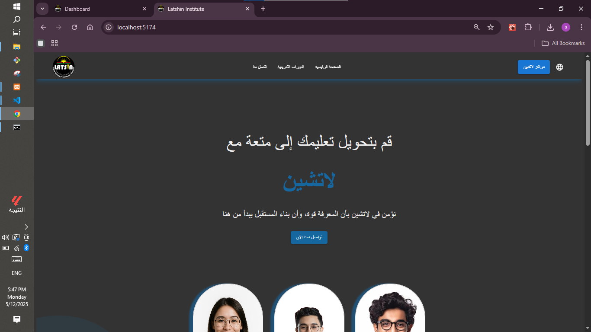

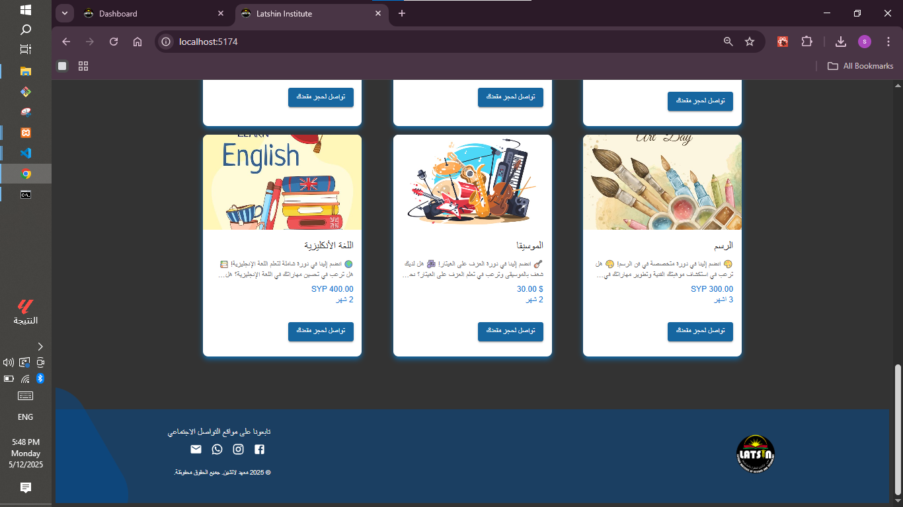
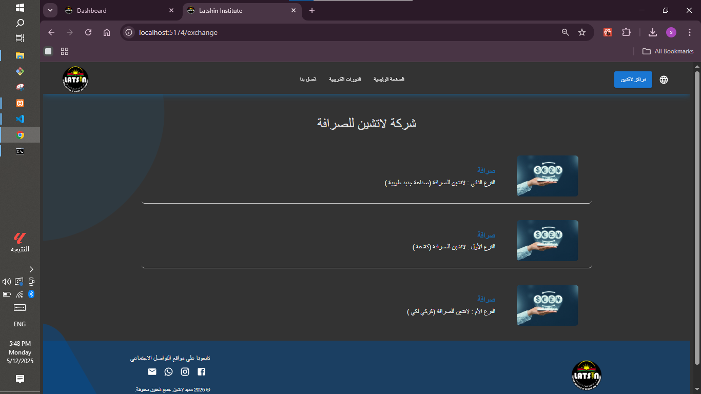

### Admin Dashboard  
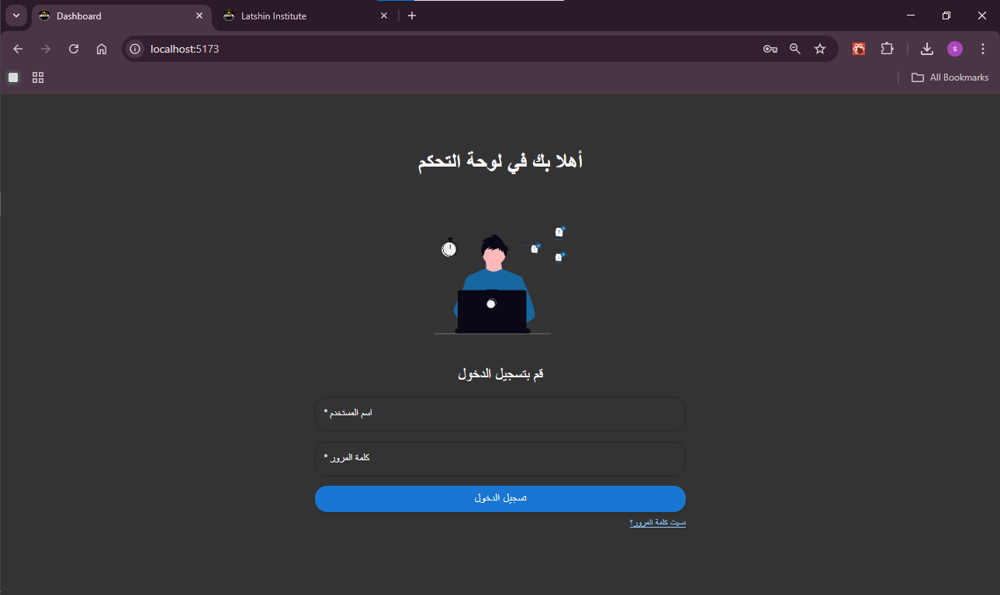
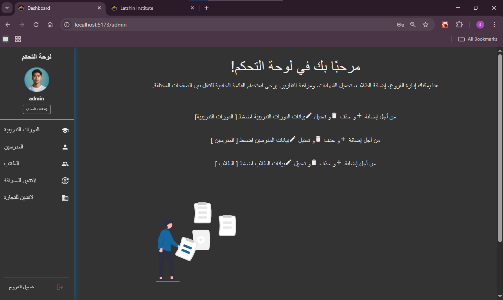
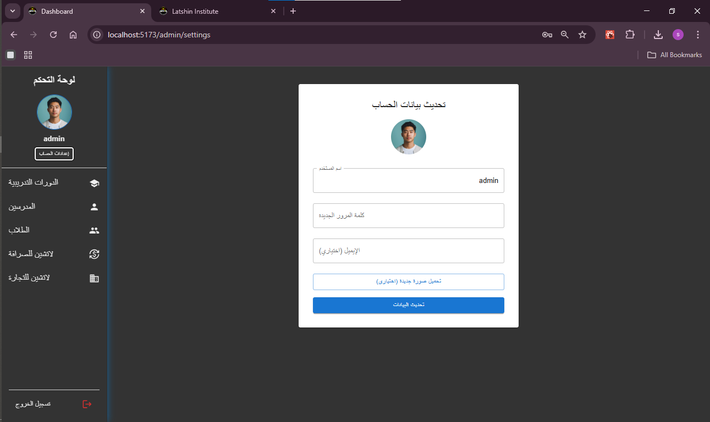
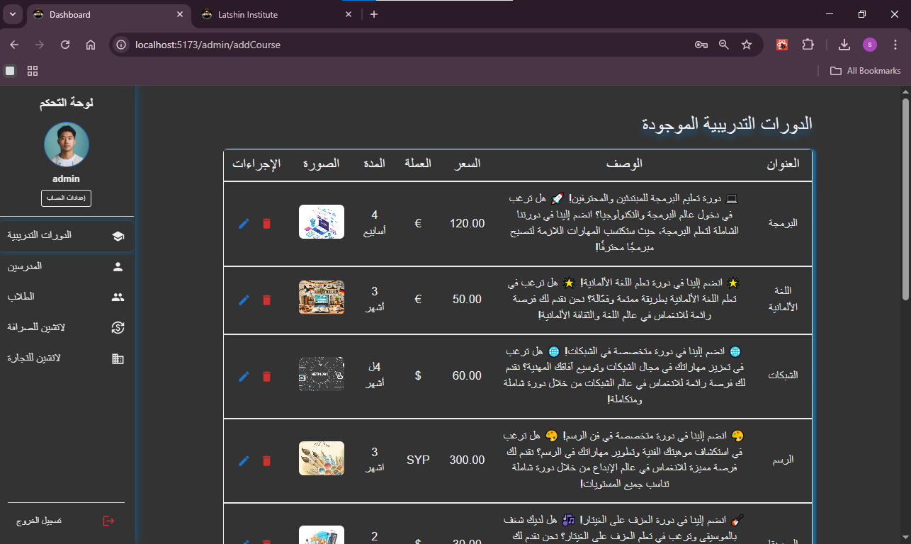
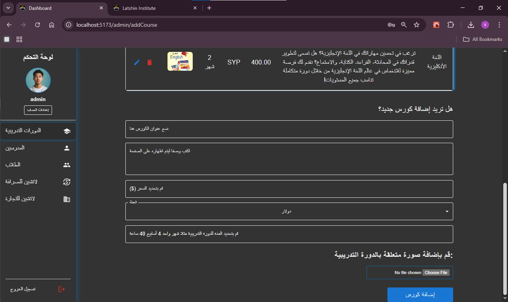
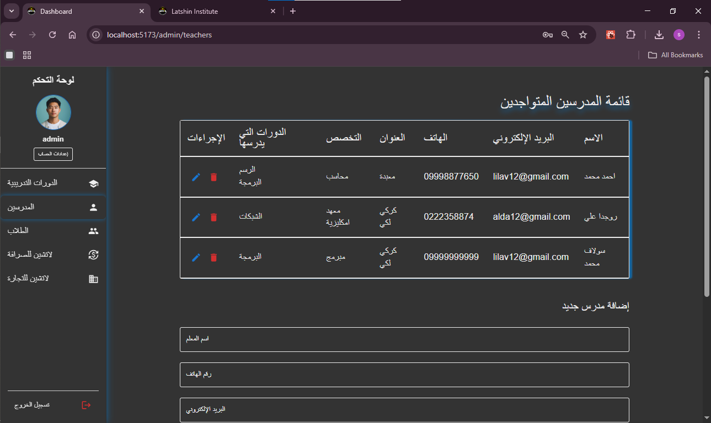
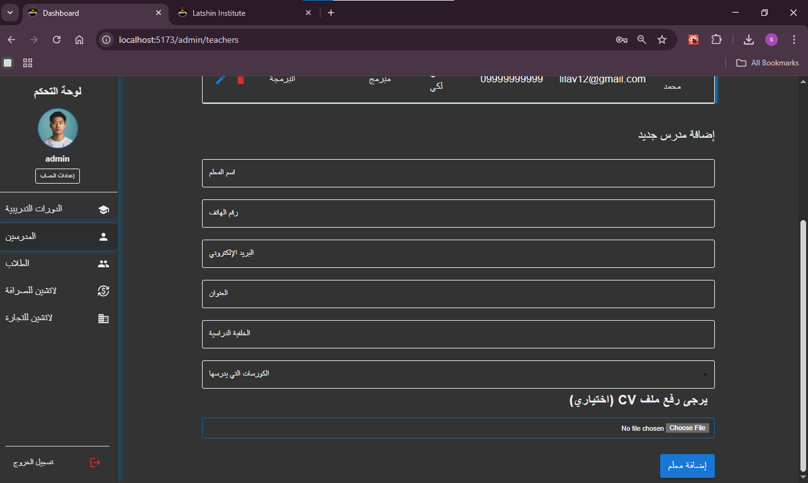
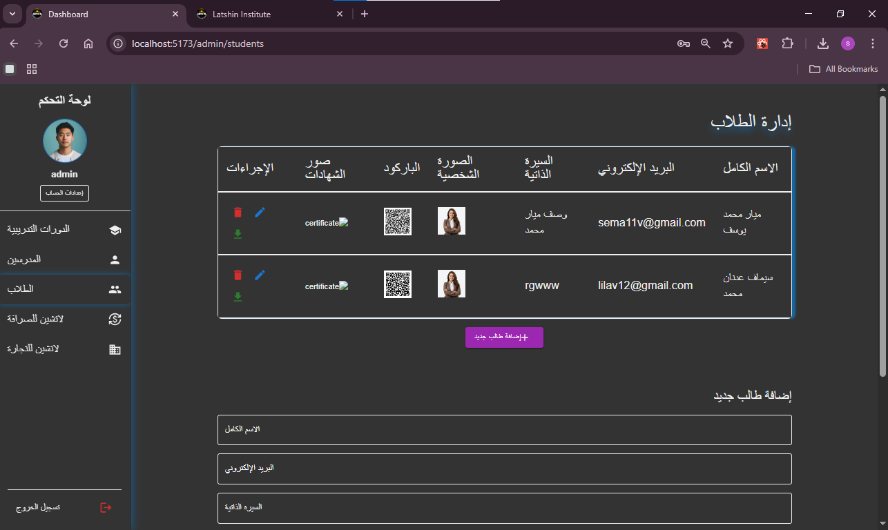
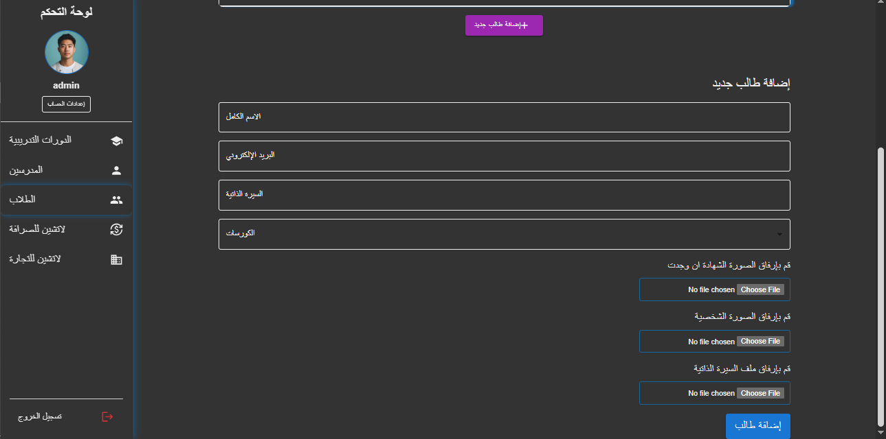
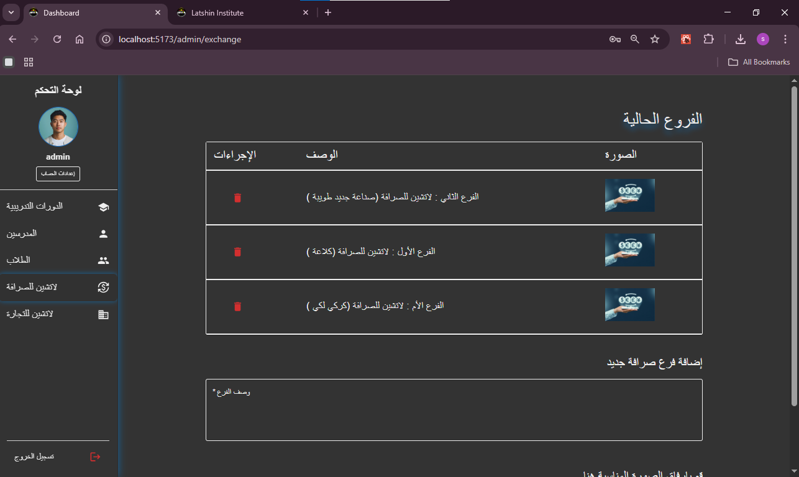

### Student Form  
after  scan the QR on certification
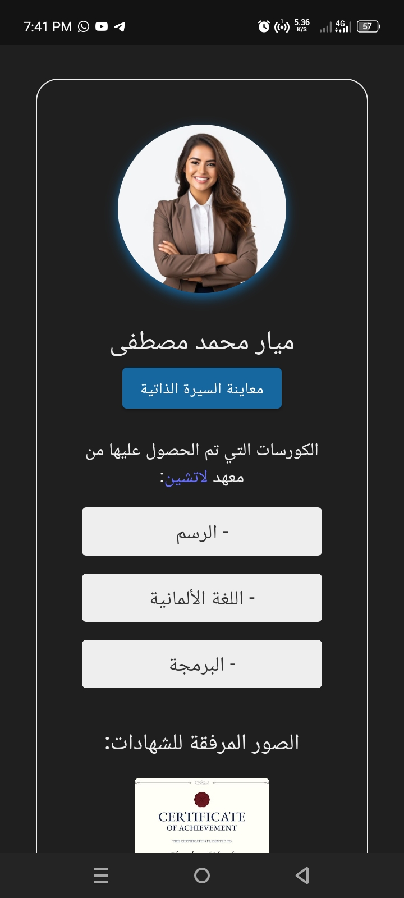

---

> ⚠️ This repository only contains a preview of the front-end interface. The full source code and backend logic (PHP, MySQL) are not publicly available for security reasons.

---

## 📩 Contact

If you'd like to know more or work together:

**Simav Adnan Mohamed**  
📧 simav@example.com  
🌐 [LinkedIn Profile](www.linkedin.com/in/simav-mehamed)
